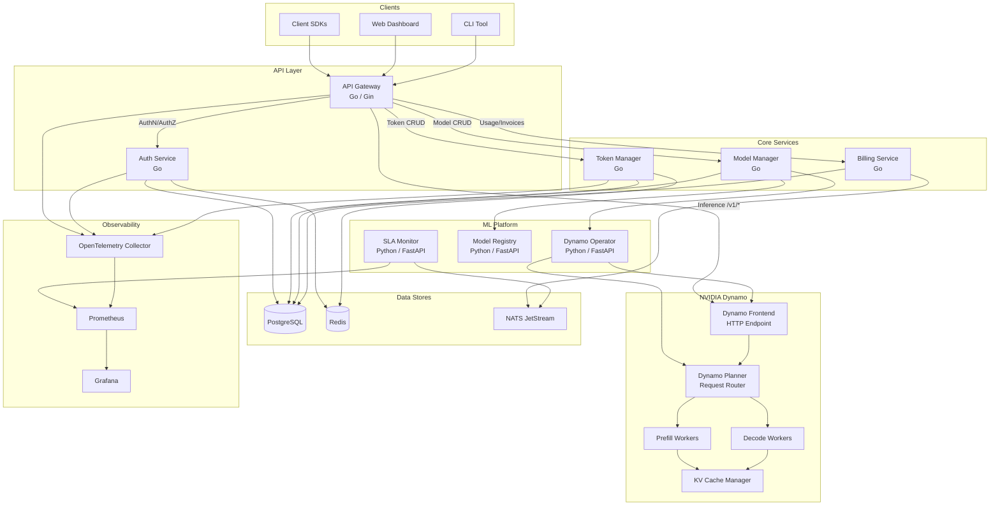
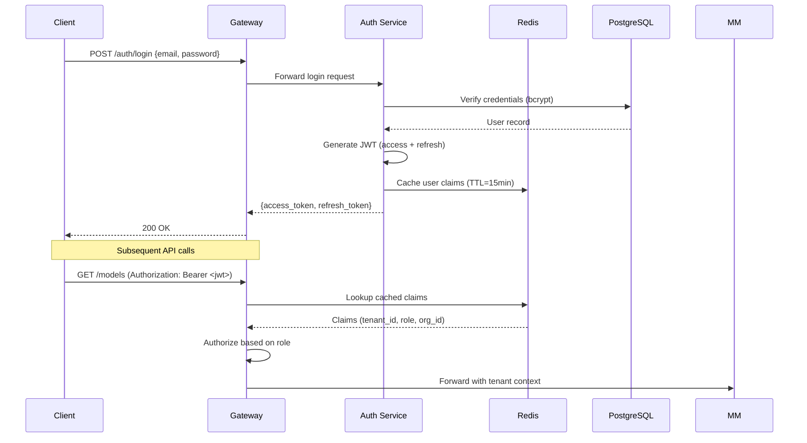
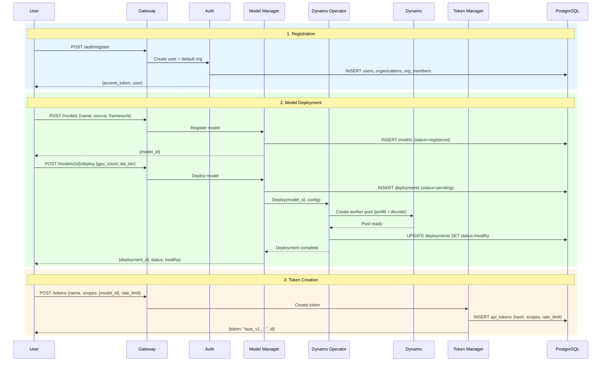
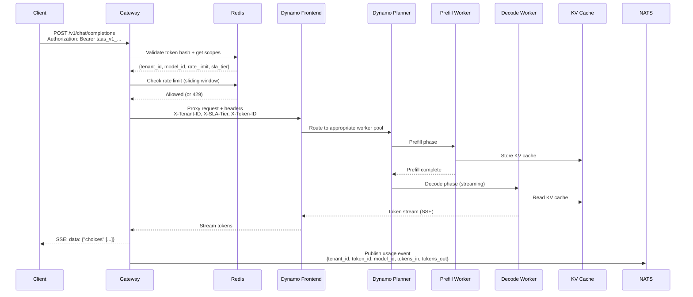
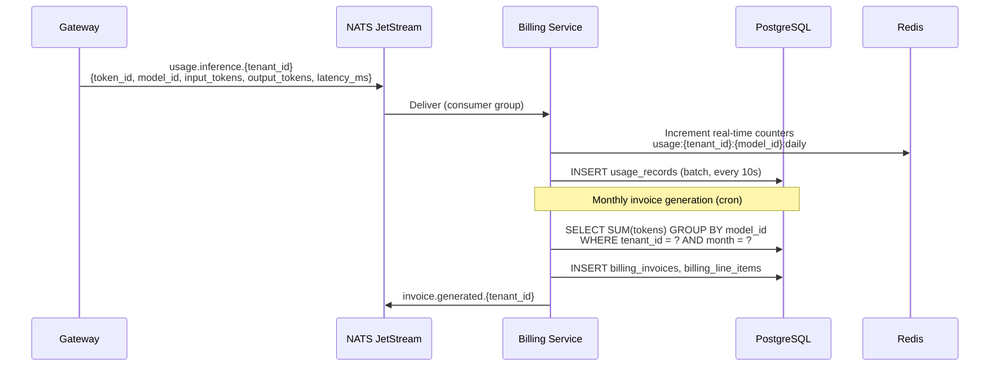
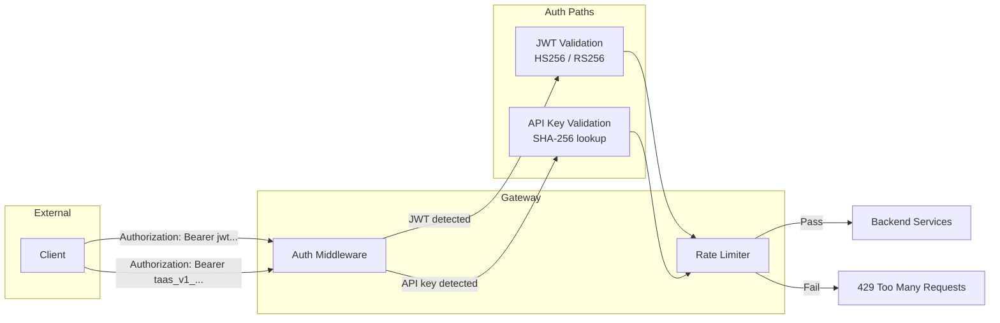
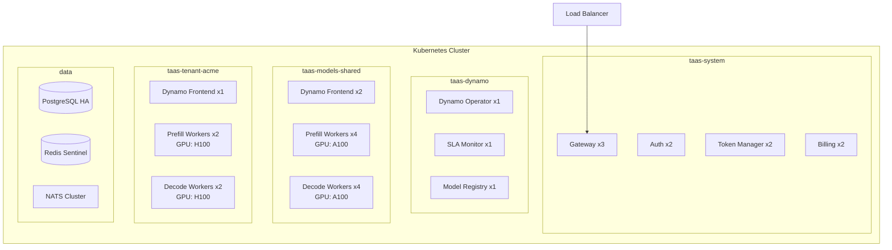

# TaaS System Architecture

## 1. System Overview

TaaS (Token as a Service) is a multi-tenant model inference platform built on NVIDIA Dynamo. It provides organizations with the ability to deploy LLMs, manage scoped API tokens, share inference services across teams, and enforce SLA guarantees — all through a unified API that is wire-compatible with the OpenAI API.



## 2. Service Decomposition

### 2.1 API Gateway (Go / Gin)

The single entry point for all external traffic.

**Responsibilities:**
- Route requests to backend services or directly to Dynamo for inference
- Authenticate every request (JWT or API Key)
- Enforce rate limits per token using Redis sliding-window counters
- Inject tenant context headers (`X-Tenant-ID`, `X-Token-ID`, `X-SLA-Tier`) into upstream requests
- Stream SSE responses for `/v1/chat/completions?stream=true`
- Expose `/healthz` and `/readyz` probes
- Emit OpenTelemetry spans for every request

**Key Design:**
- Inference requests (`/v1/*`) are proxied directly to the Dynamo Frontend with tenant headers, avoiding an extra hop through Go business logic
- Non-inference requests are routed to internal gRPC/HTTP services
- The gateway maintains a connection pool to Dynamo Frontend via HTTP/2

### 2.2 Auth Service (Go)

Handles identity, authentication, and authorization.

**Responsibilities:**
- User registration and login (email/password, OAuth2)
- JWT issuance (access token: 15min, refresh token: 7d)
- Organization management (create, invite members, assign roles)
- Role-based access control (RBAC): `owner`, `admin`, `member`, `viewer`
- API key validation (delegated from Gateway hot path via Redis cache)

**Auth Flow:**


### 2.3 Token Manager (Go)

Manages API keys (tokens) used for inference and API access.

**Responsibilities:**
- Create scoped API tokens with configurable permissions
- Token rotation (new token issued, old one remains valid for grace period)
- Token revocation (immediate invalidation via Redis bloom filter)
- Scope enforcement: per-model, per-endpoint, rate limit, expiry
- Token metadata: name, last-used timestamp, usage counters

**Token Format:**
```
taas_<version>_<base64(tenant_id:token_id:random)>
```
Stored as SHA-256 hash in PostgreSQL; full token only returned once at creation.

### 2.4 Model Manager (Go)

Manages the model lifecycle from upload to deployment.

**Responsibilities:**
- Model registration (metadata, source reference, framework type)
- Trigger deployments via the Dynamo Operator
- Track deployment state (pending → provisioning → healthy → draining → stopped)
- Model sharing between organizations (read-only inference access)
- Model versioning (immutable versions, mutable aliases like `latest`)

### 2.5 Billing Service (Go)

Tracks usage and generates invoices.

**Responsibilities:**
- Consume usage events from NATS JetStream
- Aggregate usage by token, model, and organization
- Generate monthly invoices with line items per model
- Support SLA tier pricing: Free (rate limited), Standard (per-token), Enterprise (reserved capacity)
- Expose usage analytics endpoints (timeseries, by-model, by-token)

### 2.6 Dynamo Operator (Python / FastAPI)

Kubernetes operator that manages Dynamo worker deployments.

**Responsibilities:**
- Translate TaaS deployment requests into Dynamo worker configurations
- Manage GPU allocation per deployment (prefill + decode worker counts)
- Handle rolling updates and canary deployments
- Monitor worker health and restart unhealthy workers
- Autoscale workers based on queue depth and latency signals

### 2.7 SLA Monitor (Python / FastAPI)

Monitors and enforces SLA guarantees.

**Responsibilities:**
- Poll Prometheus for per-tenant latency metrics (P50, P95, P99)
- Detect SLA violations and publish alerts to NATS
- Record violations in PostgreSQL for billing credits
- Provide SLA dashboards and compliance reports

## 3. Data Flow Diagrams

### 3.1 User Registration → Model Deploy → Token Creation



### 3.2 Inference Request Flow



### 3.3 Usage → Billing Flow



## 4. Multi-Tenancy Design

### 4.1 Tenant Isolation Model

TaaS enforces tenant isolation at multiple layers:

| Layer | Isolation Mechanism |
|-------|-------------------|
| **API** | Every request carries `tenant_id` extracted from JWT/API key; queries are scoped |
| **Database** | Row-level: all tables have `org_id` column; enforced via application-level middleware and PostgreSQL Row-Level Security policies |
| **Cache** | Key-prefixed: `{tenant_id}:{resource}:{id}` |
| **Inference** | Dynamo Planner routes requests to tenant-appropriate worker pools; shared models use fair-share scheduling |
| **Network** | Kubernetes NetworkPolicies restrict cross-namespace traffic |
| **Resources** | Kubernetes ResourceQuotas per namespace; Dynamo worker limits per tenant |

### 4.2 Namespace Strategy

```
k8s-namespaces:
  taas-system/        # Core platform services (Gateway, Auth, Token Manager, Billing)
  taas-dynamo/        # Shared Dynamo control plane
  taas-models-shared/ # Shared model worker pools (Free tier)
  taas-tenant-{id}/   # Dedicated namespace per Enterprise tenant
```

- **Free tier**: Shared worker pools in `taas-models-shared`, fair-share scheduling
- **Standard tier**: Shared pools with priority scheduling, guaranteed burst capacity
- **Enterprise tier**: Dedicated namespace with reserved GPU allocation

### 4.3 SLA Tiers

| Feature | Free | Standard | Enterprise |
|---------|------|----------|------------|
| Rate Limit | 10 req/min | 500 req/min | Custom |
| Latency SLA | Best-effort | P95 < 2s | P99 < 500ms |
| GPU Allocation | Shared, preemptible | Shared, priority | Dedicated |
| Models | 1 deployed | 10 deployed | Unlimited |
| Support | Community | Email (24h) | Dedicated (1h) |
| SLA Credit | None | 10% on violation | 25% on violation |
| Token Limit | 1M tokens/month | 100M tokens/month | Custom |

## 5. Security Architecture

### 5.1 Authentication Flow



**JWT Structure:**
```json
{
  "sub": "user_01H8...",
  "org_id": "org_01H8...",
  "role": "admin",
  "iss": "taas-auth",
  "exp": 1700000000,
  "iat": 1699999100
}
```

**API Key Scoping:**
```json
{
  "token_id": "tok_01H8...",
  "org_id": "org_01H8...",
  "scopes": {
    "models": ["model_01H8..."],
    "endpoints": ["/v1/chat/completions"],
    "rate_limit": 100,
    "expires_at": "2025-12-31T23:59:59Z"
  }
}
```

### 5.2 Service-to-Service Security

- **mTLS**: All inter-service communication uses mutual TLS via Kubernetes service mesh (Istio/Linkerd)
- **Service accounts**: Each service has a unique Kubernetes ServiceAccount with minimal RBAC
- **Network policies**: Default-deny ingress; explicit allow rules per service pair
- **Secrets**: Managed via Kubernetes Secrets (production: HashiCorp Vault or AWS Secrets Manager)

### 5.3 API Key Security

1. **Storage**: Only SHA-256 hash stored in database; raw key shown once at creation
2. **Transmission**: TLS required for all API traffic; HSTS enforced
3. **Revocation**: Immediate via Redis bloom filter (checked before DB lookup)
4. **Rotation**: Grace period (configurable, default 24h) where both old and new keys are valid
5. **Audit**: All token operations logged with actor, IP, and timestamp

## 6. Gateway → Dynamo Request Routing

The API Gateway handles inference requests by proxying them directly to the NVIDIA Dynamo Frontend, enriched with tenant context.

### 6.1 Routing Flow

```mermaid
graph TD
    GW[API Gateway] -->|1. Extract model from path/body| RESOLVE[Resolve Model → Deployment]
    RESOLVE -->|2. Lookup deployment endpoint| CACHE[Redis: deployment:{model_id}]
    CACHE -->|3. Get Dynamo Frontend URL| PROXY[Reverse Proxy]
    PROXY -->|4. Add headers| DF[Dynamo Frontend]

    subgraph Injected Headers
        H1[X-Tenant-ID: org_01H8...]
        H2[X-Token-ID: tok_01H8...]
        H3[X-SLA-Tier: standard]
        H4[X-Rate-Limit-Remaining: 450]
        H5[X-Request-ID: req_01H8...]
    end

    PROXY --> H1
    PROXY --> H2
    PROXY --> H3
    PROXY --> H4
    PROXY --> H5
```

### 6.2 Model Resolution

For OpenAI-compatible endpoints, the `model` field in the request body maps to a TaaS model:

```
POST /v1/chat/completions
{"model": "org-acme/llama-70b", ...}

Resolution:
  1. Parse org slug + model name from "model" field
  2. Verify token has access to this model (owned or shared)
  3. Lookup active deployment for this model
  4. Get Dynamo Frontend endpoint from deployment record
  5. Proxy request to Dynamo with tenant headers
```

### 6.3 Streaming Support

- Gateway uses HTTP/2 upstream connections to Dynamo Frontend
- SSE events from Dynamo are forwarded as-is to the client
- Gateway counts tokens from SSE events for usage tracking without buffering the full response
- On client disconnect, Gateway sends cancellation signal to Dynamo

## 7. Observability

### 7.1 Metrics (Prometheus)

Every service exposes `/metrics` in Prometheus format:

| Metric | Type | Labels |
|--------|------|--------|
| `taas_request_duration_seconds` | Histogram | `service`, `method`, `path`, `status` |
| `taas_inference_tokens_total` | Counter | `tenant_id`, `model_id`, `direction` (input/output) |
| `taas_inference_latency_seconds` | Histogram | `tenant_id`, `model_id`, `phase` (prefill/decode) |
| `taas_token_validation_duration_seconds` | Histogram | `method` (jwt/apikey), `result` (ok/expired/revoked) |
| `taas_rate_limit_hits_total` | Counter | `tenant_id`, `token_id` |
| `taas_deployment_status` | Gauge | `model_id`, `status` |

### 7.2 Distributed Tracing (OpenTelemetry)

Every request gets a trace ID propagated through all services:

```
Client → Gateway → Auth → TokenManager → DynamoFrontend → Planner → Worker
  |         |         |         |              |              |         |
  └─────────┴─────────┴─────────┴──────────────┴──────────────┴─────────┘
                        Single trace, correlated spans
```

### 7.3 Structured Logging

All services emit JSON logs with consistent fields:

```json
{
  "timestamp": "2026-01-15T10:30:00Z",
  "level": "info",
  "service": "gateway",
  "trace_id": "abc123",
  "tenant_id": "org_01H8...",
  "msg": "inference request completed",
  "method": "POST",
  "path": "/v1/chat/completions",
  "status": 200,
  "duration_ms": 1250,
  "tokens_in": 150,
  "tokens_out": 500
}
```

## 8. Deployment Architecture



### 8.1 Scaling Strategy

| Component | Scaling | Trigger |
|-----------|---------|---------|
| Gateway | HPA | CPU > 60%, request rate |
| Auth Service | HPA | CPU > 70% |
| Token Manager | HPA | CPU > 70% |
| Billing Service | HPA | NATS consumer lag |
| Dynamo Workers | Custom (Operator) | Queue depth, P95 latency |
| PostgreSQL | Vertical + read replicas | Connection count, query latency |
| Redis | Sentinel HA | Memory usage |
