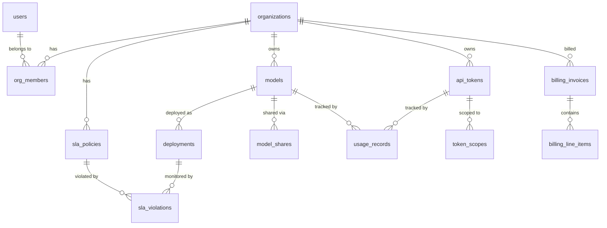

# TaaS Data Model

## 1. PostgreSQL Schema

### 1.1 Entity Relationship Diagram



### 1.2 Extensions

```sql
CREATE EXTENSION IF NOT EXISTS "pgcrypto";     -- gen_random_uuid()
CREATE EXTENSION IF NOT EXISTS "pg_trgm";      -- trigram index for search
```

### 1.3 Users & Organizations

```sql
-- ============================================================
-- USERS
-- ============================================================
CREATE TABLE users (
    id              UUID PRIMARY KEY DEFAULT gen_random_uuid(),
    email           TEXT NOT NULL UNIQUE,
    password_hash   TEXT NOT NULL,
    display_name    TEXT NOT NULL,
    avatar_url      TEXT,
    email_verified  BOOLEAN NOT NULL DEFAULT FALSE,
    status          TEXT NOT NULL DEFAULT 'active'
                    CHECK (status IN ('active', 'suspended', 'deleted')),
    created_at      TIMESTAMPTZ NOT NULL DEFAULT now(),
    updated_at      TIMESTAMPTZ NOT NULL DEFAULT now()
);

CREATE INDEX idx_users_email ON users (email);
CREATE INDEX idx_users_status ON users (status) WHERE status = 'active';

-- ============================================================
-- ORGANIZATIONS
-- ============================================================
CREATE TABLE organizations (
    id              UUID PRIMARY KEY DEFAULT gen_random_uuid(),
    slug            TEXT NOT NULL UNIQUE,
    display_name    TEXT NOT NULL,
    sla_tier        TEXT NOT NULL DEFAULT 'free'
                    CHECK (sla_tier IN ('free', 'standard', 'enterprise')),
    metadata        JSONB NOT NULL DEFAULT '{}',
    created_at      TIMESTAMPTZ NOT NULL DEFAULT now(),
    updated_at      TIMESTAMPTZ NOT NULL DEFAULT now()
);

CREATE INDEX idx_organizations_slug ON organizations (slug);

-- ============================================================
-- ORGANIZATION MEMBERS
-- ============================================================
CREATE TABLE org_members (
    id              UUID PRIMARY KEY DEFAULT gen_random_uuid(),
    org_id          UUID NOT NULL REFERENCES organizations(id) ON DELETE CASCADE,
    user_id         UUID NOT NULL REFERENCES users(id) ON DELETE CASCADE,
    role            TEXT NOT NULL DEFAULT 'member'
                    CHECK (role IN ('owner', 'admin', 'member', 'viewer')),
    invited_by      UUID REFERENCES users(id),
    joined_at       TIMESTAMPTZ NOT NULL DEFAULT now(),
    UNIQUE (org_id, user_id)
);

CREATE INDEX idx_org_members_org ON org_members (org_id);
CREATE INDEX idx_org_members_user ON org_members (user_id);
```

### 1.4 Models & Deployments

```sql
-- ============================================================
-- MODELS
-- ============================================================
CREATE TABLE models (
    id              UUID PRIMARY KEY DEFAULT gen_random_uuid(),
    org_id          UUID NOT NULL REFERENCES organizations(id) ON DELETE CASCADE,
    name            TEXT NOT NULL,
    description     TEXT NOT NULL DEFAULT '',
    framework       TEXT NOT NULL
                    CHECK (framework IN ('sglang', 'vllm', 'tensorrt_llm')),
    source_uri      TEXT NOT NULL,                -- e.g., s3://bucket/model.tar.gz or hf://org/model
    version         TEXT NOT NULL DEFAULT 'v1',
    parameters      JSONB NOT NULL DEFAULT '{}',  -- model-specific config (dtype, context_length, etc.)
    status          TEXT NOT NULL DEFAULT 'registered'
                    CHECK (status IN ('registered', 'validating', 'ready', 'archived')),
    created_by      UUID NOT NULL REFERENCES users(id),
    created_at      TIMESTAMPTZ NOT NULL DEFAULT now(),
    updated_at      TIMESTAMPTZ NOT NULL DEFAULT now(),
    UNIQUE (org_id, name, version)
);

CREATE INDEX idx_models_org ON models (org_id);
CREATE INDEX idx_models_status ON models (status);
CREATE INDEX idx_models_name_trgm ON models USING gin (name gin_trgm_ops);

-- ============================================================
-- DEPLOYMENTS
-- ============================================================
CREATE TABLE deployments (
    id              UUID PRIMARY KEY DEFAULT gen_random_uuid(),
    model_id        UUID NOT NULL REFERENCES models(id) ON DELETE CASCADE,
    org_id          UUID NOT NULL REFERENCES organizations(id) ON DELETE CASCADE,
    status          TEXT NOT NULL DEFAULT 'pending'
                    CHECK (status IN ('pending', 'provisioning', 'healthy', 'degraded', 'draining', 'stopped', 'failed')),
    dynamo_config   JSONB NOT NULL DEFAULT '{}',
    -- Dynamo config example:
    -- {
    --   "prefill_workers": 2,
    --   "decode_workers": 2,
    --   "gpu_type": "A100",
    --   "tensor_parallel": 4,
    --   "max_batch_size": 64,
    --   "max_sequence_length": 4096
    -- }
    endpoint_url    TEXT,                          -- Dynamo Frontend URL once healthy
    namespace       TEXT NOT NULL,                 -- K8s namespace for this deployment
    gpu_count       INT NOT NULL DEFAULT 1,
    replicas        JSONB NOT NULL DEFAULT '{"prefill": 1, "decode": 1}',
    health_check_at TIMESTAMPTZ,
    started_at      TIMESTAMPTZ,
    stopped_at      TIMESTAMPTZ,
    created_at      TIMESTAMPTZ NOT NULL DEFAULT now(),
    updated_at      TIMESTAMPTZ NOT NULL DEFAULT now()
);

CREATE INDEX idx_deployments_model ON deployments (model_id);
CREATE INDEX idx_deployments_org ON deployments (org_id);
CREATE INDEX idx_deployments_status ON deployments (status) WHERE status IN ('healthy', 'degraded');

-- ============================================================
-- MODEL SHARES
-- ============================================================
CREATE TABLE model_shares (
    id              UUID PRIMARY KEY DEFAULT gen_random_uuid(),
    model_id        UUID NOT NULL REFERENCES models(id) ON DELETE CASCADE,
    owner_org_id    UUID NOT NULL REFERENCES organizations(id) ON DELETE CASCADE,
    shared_with_org UUID NOT NULL REFERENCES organizations(id) ON DELETE CASCADE,
    permission      TEXT NOT NULL DEFAULT 'inference'
                    CHECK (permission IN ('inference', 'read')),
    created_by      UUID NOT NULL REFERENCES users(id),
    created_at      TIMESTAMPTZ NOT NULL DEFAULT now(),
    expires_at      TIMESTAMPTZ,
    UNIQUE (model_id, shared_with_org)
);

CREATE INDEX idx_model_shares_shared_with ON model_shares (shared_with_org);
CREATE INDEX idx_model_shares_model ON model_shares (model_id);
```

### 1.5 API Tokens

```sql
-- ============================================================
-- API TOKENS
-- ============================================================
CREATE TABLE api_tokens (
    id              UUID PRIMARY KEY DEFAULT gen_random_uuid(),
    org_id          UUID NOT NULL REFERENCES organizations(id) ON DELETE CASCADE,
    created_by      UUID NOT NULL REFERENCES users(id),
    name            TEXT NOT NULL,
    token_hash      TEXT NOT NULL UNIQUE,          -- SHA-256 hash of the raw token
    token_prefix    TEXT NOT NULL,                 -- First 8 chars for identification (e.g., "taas_v1_")
    status          TEXT NOT NULL DEFAULT 'active'
                    CHECK (status IN ('active', 'rotated', 'revoked', 'expired')),
    rate_limit      INT NOT NULL DEFAULT 100,      -- requests per minute
    expires_at      TIMESTAMPTZ,
    last_used_at    TIMESTAMPTZ,
    rotated_from    UUID REFERENCES api_tokens(id),  -- link to previous token on rotation
    grace_until     TIMESTAMPTZ,                     -- old token valid until this time after rotation
    created_at      TIMESTAMPTZ NOT NULL DEFAULT now(),
    revoked_at      TIMESTAMPTZ
);

CREATE INDEX idx_api_tokens_hash ON api_tokens USING hash (token_hash);
CREATE INDEX idx_api_tokens_org ON api_tokens (org_id);
CREATE INDEX idx_api_tokens_status ON api_tokens (status) WHERE status = 'active';

-- ============================================================
-- TOKEN SCOPES
-- ============================================================
CREATE TABLE token_scopes (
    id              UUID PRIMARY KEY DEFAULT gen_random_uuid(),
    token_id        UUID NOT NULL REFERENCES api_tokens(id) ON DELETE CASCADE,
    scope_type      TEXT NOT NULL
                    CHECK (scope_type IN ('model', 'endpoint', 'action')),
    scope_value     TEXT NOT NULL
    -- scope_type='model' → scope_value=model_id
    -- scope_type='endpoint' → scope_value='/v1/chat/completions'
    -- scope_type='action' → scope_value='inference', 'manage', 'admin'
);

CREATE INDEX idx_token_scopes_token ON token_scopes (token_id);
```

### 1.6 Usage Records

Usage records are partitioned by month for query performance and data retention.

```sql
-- ============================================================
-- USAGE RECORDS (partitioned by month)
-- ============================================================
CREATE TABLE usage_records (
    id              UUID NOT NULL DEFAULT gen_random_uuid(),
    org_id          UUID NOT NULL,
    token_id        UUID NOT NULL,
    model_id        UUID NOT NULL,
    request_id      TEXT NOT NULL,
    input_tokens    INT NOT NULL DEFAULT 0,
    output_tokens   INT NOT NULL DEFAULT 0,
    total_tokens    INT NOT NULL GENERATED ALWAYS AS (input_tokens + output_tokens) STORED,
    latency_ms      INT NOT NULL DEFAULT 0,
    status_code     INT NOT NULL DEFAULT 200,
    recorded_at     TIMESTAMPTZ NOT NULL DEFAULT now(),
    PRIMARY KEY (recorded_at, id)
) PARTITION BY RANGE (recorded_at);

-- Create partitions (automated via cron or pg_partman)
CREATE TABLE usage_records_2026_01 PARTITION OF usage_records
    FOR VALUES FROM ('2026-01-01') TO ('2026-02-01');
CREATE TABLE usage_records_2026_02 PARTITION OF usage_records
    FOR VALUES FROM ('2026-02-01') TO ('2026-03-01');
CREATE TABLE usage_records_2026_03 PARTITION OF usage_records
    FOR VALUES FROM ('2026-03-01') TO ('2026-04-01');
CREATE TABLE usage_records_2026_04 PARTITION OF usage_records
    FOR VALUES FROM ('2026-04-01') TO ('2026-05-01');

CREATE INDEX idx_usage_org_recorded ON usage_records (org_id, recorded_at);
CREATE INDEX idx_usage_token_recorded ON usage_records (token_id, recorded_at);
CREATE INDEX idx_usage_model_recorded ON usage_records (model_id, recorded_at);
```

### 1.7 Billing

```sql
-- ============================================================
-- BILLING INVOICES
-- ============================================================
CREATE TABLE billing_invoices (
    id              UUID PRIMARY KEY DEFAULT gen_random_uuid(),
    org_id          UUID NOT NULL REFERENCES organizations(id) ON DELETE CASCADE,
    period_start    DATE NOT NULL,
    period_end      DATE NOT NULL,
    status          TEXT NOT NULL DEFAULT 'draft'
                    CHECK (status IN ('draft', 'finalized', 'paid', 'overdue', 'void')),
    subtotal_cents  BIGINT NOT NULL DEFAULT 0,
    credit_cents    BIGINT NOT NULL DEFAULT 0,       -- SLA violation credits
    tax_cents       BIGINT NOT NULL DEFAULT 0,
    total_cents     BIGINT NOT NULL DEFAULT 0,
    currency        TEXT NOT NULL DEFAULT 'USD',
    issued_at       TIMESTAMPTZ,
    due_at          TIMESTAMPTZ,
    paid_at         TIMESTAMPTZ,
    created_at      TIMESTAMPTZ NOT NULL DEFAULT now(),
    UNIQUE (org_id, period_start)
);

CREATE INDEX idx_billing_invoices_org ON billing_invoices (org_id);
CREATE INDEX idx_billing_invoices_status ON billing_invoices (status);

-- ============================================================
-- BILLING LINE ITEMS
-- ============================================================
CREATE TABLE billing_line_items (
    id              UUID PRIMARY KEY DEFAULT gen_random_uuid(),
    invoice_id      UUID NOT NULL REFERENCES billing_invoices(id) ON DELETE CASCADE,
    model_id        UUID NOT NULL,
    description     TEXT NOT NULL,
    input_tokens    BIGINT NOT NULL DEFAULT 0,
    output_tokens   BIGINT NOT NULL DEFAULT 0,
    unit_price_input  NUMERIC(12, 8) NOT NULL,      -- price per token (input)
    unit_price_output NUMERIC(12, 8) NOT NULL,      -- price per token (output)
    amount_cents    BIGINT NOT NULL DEFAULT 0,
    created_at      TIMESTAMPTZ NOT NULL DEFAULT now()
);

CREATE INDEX idx_billing_line_items_invoice ON billing_line_items (invoice_id);
```

### 1.8 SLA Policies & Violations

```sql
-- ============================================================
-- SLA POLICIES
-- ============================================================
CREATE TABLE sla_policies (
    id              UUID PRIMARY KEY DEFAULT gen_random_uuid(),
    org_id          UUID NOT NULL REFERENCES organizations(id) ON DELETE CASCADE,
    tier            TEXT NOT NULL
                    CHECK (tier IN ('free', 'standard', 'enterprise')),
    p95_latency_ms  INT NOT NULL,                   -- target P95 latency
    p99_latency_ms  INT NOT NULL,                   -- target P99 latency
    uptime_pct      NUMERIC(5, 2) NOT NULL,         -- e.g., 99.90
    credit_pct      NUMERIC(5, 2) NOT NULL DEFAULT 0, -- credit % on violation
    max_requests_per_min INT NOT NULL,
    max_tokens_per_month BIGINT NOT NULL,
    effective_from  DATE NOT NULL,
    effective_to    DATE,
    created_at      TIMESTAMPTZ NOT NULL DEFAULT now()
);

CREATE INDEX idx_sla_policies_org ON sla_policies (org_id);

-- ============================================================
-- SLA VIOLATIONS
-- ============================================================
CREATE TABLE sla_violations (
    id              UUID PRIMARY KEY DEFAULT gen_random_uuid(),
    org_id          UUID NOT NULL REFERENCES organizations(id) ON DELETE CASCADE,
    deployment_id   UUID NOT NULL REFERENCES deployments(id) ON DELETE CASCADE,
    policy_id       UUID NOT NULL REFERENCES sla_policies(id),
    violation_type  TEXT NOT NULL
                    CHECK (violation_type IN ('latency_p95', 'latency_p99', 'uptime', 'error_rate')),
    observed_value  NUMERIC(12, 4) NOT NULL,        -- actual value that violated
    threshold_value NUMERIC(12, 4) NOT NULL,        -- SLA threshold
    window_start    TIMESTAMPTZ NOT NULL,
    window_end      TIMESTAMPTZ NOT NULL,
    credit_cents    BIGINT NOT NULL DEFAULT 0,       -- credit applied
    acknowledged    BOOLEAN NOT NULL DEFAULT FALSE,
    created_at      TIMESTAMPTZ NOT NULL DEFAULT now()
);

CREATE INDEX idx_sla_violations_org ON sla_violations (org_id, created_at);
CREATE INDEX idx_sla_violations_deployment ON sla_violations (deployment_id);
```

### 1.9 Row-Level Security

```sql
-- Enable RLS on tenant-scoped tables
ALTER TABLE models ENABLE ROW LEVEL SECURITY;
ALTER TABLE deployments ENABLE ROW LEVEL SECURITY;
ALTER TABLE api_tokens ENABLE ROW LEVEL SECURITY;
ALTER TABLE usage_records ENABLE ROW LEVEL SECURITY;
ALTER TABLE billing_invoices ENABLE ROW LEVEL SECURITY;

-- Policy: services set current_setting('app.current_org_id') per-connection
CREATE POLICY tenant_isolation_models ON models
    USING (org_id = current_setting('app.current_org_id')::UUID);

CREATE POLICY tenant_isolation_deployments ON deployments
    USING (org_id = current_setting('app.current_org_id')::UUID);

CREATE POLICY tenant_isolation_tokens ON api_tokens
    USING (org_id = current_setting('app.current_org_id')::UUID);

CREATE POLICY tenant_isolation_usage ON usage_records
    USING (org_id = current_setting('app.current_org_id')::UUID);

CREATE POLICY tenant_isolation_billing ON billing_invoices
    USING (org_id = current_setting('app.current_org_id')::UUID);

-- Admin bypass role
CREATE ROLE taas_admin;
CREATE POLICY admin_bypass_models ON models TO taas_admin USING (true);
CREATE POLICY admin_bypass_deployments ON deployments TO taas_admin USING (true);
CREATE POLICY admin_bypass_tokens ON api_tokens TO taas_admin USING (true);
CREATE POLICY admin_bypass_usage ON usage_records TO taas_admin USING (true);
CREATE POLICY admin_bypass_billing ON billing_invoices TO taas_admin USING (true);
```

## 2. Redis Data Structures

### 2.1 Token Cache

Fast-path token validation — avoids PostgreSQL on every inference request.

```
Key:    token:{sha256_hash}
Type:   HASH
TTL:    300s (5 min)
Fields:
  token_id      UUID
  org_id        UUID
  status        "active" | "revoked"
  rate_limit    INT (requests per minute)
  scopes        JSON string of scopes array
  sla_tier      "free" | "standard" | "enterprise"

SET:    On token creation and first validation cache-miss
DEL:    On token revocation (immediate invalidation)
```

### 2.2 Revoked Token Bloom Filter

Probabilistic check before cache/DB lookup — instant rejection of revoked tokens.

```
Key:    revoked_tokens_bloom
Type:   BF (RedisBloom module)
Config: BF.RESERVE revoked_tokens_bloom 0.001 1000000  -- 0.1% FP, 1M capacity

BF.ADD on token revocation
BF.EXISTS on every request (before cache lookup)
```

### 2.3 Rate Limit Counters (Sliding Window)

```
Key:    ratelimit:{token_id}:{window_minute}
Type:   STRING (integer counter)
TTL:    120s (covers current + previous window)

Algorithm: Sliding window log
  current_count = GET ratelimit:{token_id}:{current_minute}
  prev_count    = GET ratelimit:{token_id}:{prev_minute}
  weight        = 1 - (current_second / 60)
  effective     = current_count + (prev_count * weight)

  if effective >= rate_limit: reject (429)
  else: INCR ratelimit:{token_id}:{current_minute}
```

### 2.4 Real-Time Usage Aggregation

Pre-aggregated counters for the usage dashboard (updated on every inference).

```
Key:    usage:{org_id}:{model_id}:daily:{YYYY-MM-DD}
Type:   HASH
TTL:    48h
Fields:
  input_tokens    INT (HINCRBY on each request)
  output_tokens   INT
  request_count   INT
  error_count     INT
  total_latency_ms INT (for computing average)

Key:    usage:{org_id}:monthly:{YYYY-MM}
Type:   HASH
TTL:    35d
Fields:
  input_tokens    INT
  output_tokens   INT
  request_count   INT
```

### 2.5 Deployment Endpoint Cache

Maps model IDs to their active Dynamo Frontend endpoints.

```
Key:    deployment:{model_id}:endpoint
Type:   STRING
TTL:    60s
Value:  "https://dynamo-frontend-{deployment_id}.taas-models-shared.svc:8080"

SET:    By Dynamo Operator on deployment status change
DEL:    On undeployment
```

### 2.6 Session / Refresh Token Store

```
Key:    refresh:{user_id}:{token_jti}
Type:   STRING
TTL:    604800s (7 days)
Value:  JSON {issued_at, ip, user_agent}

DEL:    On logout or refresh token rotation
```

## 3. NATS JetStream Subjects & Streams

### 3.1 Streams

```
Stream: USAGE
  Subjects: usage.inference.>
  Retention: WorkQueue (consumed once then ack'd)
  MaxAge: 7d
  Storage: File
  Replicas: 3

Stream: EVENTS
  Subjects: events.>
  Retention: Limits (keep last 10,000 per subject)
  MaxAge: 30d
  Storage: File
  Replicas: 3
```

### 3.2 Subjects

```
usage.inference.{org_id}          -- per-request usage event from Gateway
events.deployment.{model_id}      -- deployment lifecycle (pending, healthy, stopped)
events.sla.violation.{org_id}     -- SLA violation detected
events.invoice.generated.{org_id} -- invoice finalized
events.token.revoked.{org_id}     -- token revoked (triggers cache invalidation)
events.model.shared.{org_id}      -- model shared with another org
```

### 3.3 Usage Event Schema

```json
{
  "request_id": "req_01H8...",
  "org_id": "org_01H8...",
  "token_id": "tok_01H8...",
  "model_id": "model_01H8...",
  "input_tokens": 150,
  "output_tokens": 500,
  "latency_ms": 1250,
  "status_code": 200,
  "timestamp": "2026-01-15T10:30:00.123Z"
}
```

## 4. Migration Strategy

Migrations are managed via [golang-migrate](https://github.com/golang-migrate/migrate):

```
migrations/
├── 000001_create_users.up.sql
├── 000001_create_users.down.sql
├── 000002_create_organizations.up.sql
├── 000002_create_organizations.down.sql
├── 000003_create_models.up.sql
├── 000003_create_models.down.sql
├── 000004_create_api_tokens.up.sql
├── 000004_create_api_tokens.down.sql
├── 000005_create_usage_records.up.sql
├── 000005_create_usage_records.down.sql
├── 000006_create_billing.up.sql
├── 000006_create_billing.down.sql
├── 000007_create_sla.up.sql
├── 000007_create_sla.down.sql
├── 000008_create_model_shares.up.sql
├── 000008_create_model_shares.down.sql
└── 000009_enable_rls.up.sql
```

Partitions for `usage_records` are created automatically via a monthly cron job or pg_partman extension.
