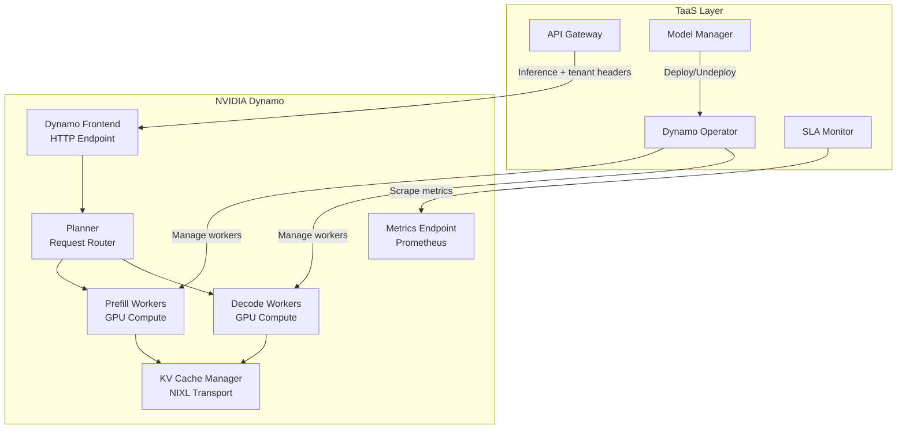
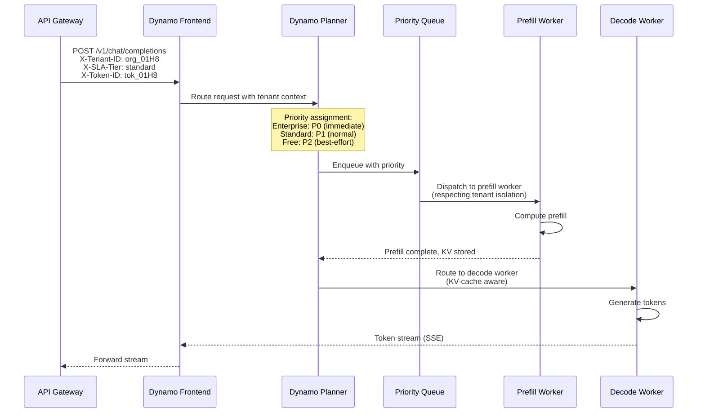
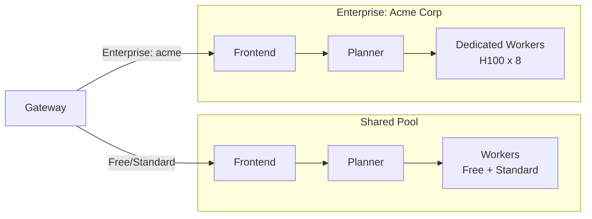
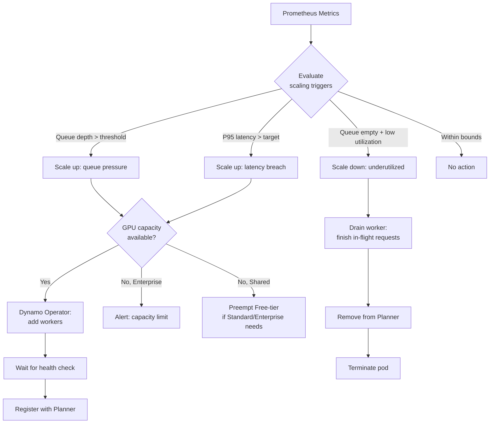
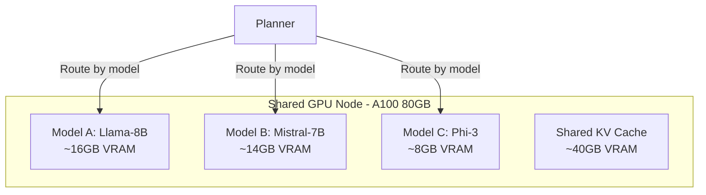
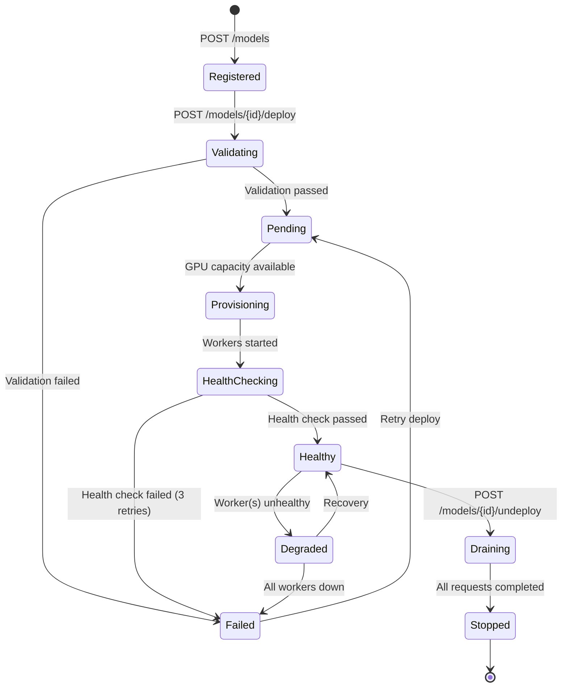
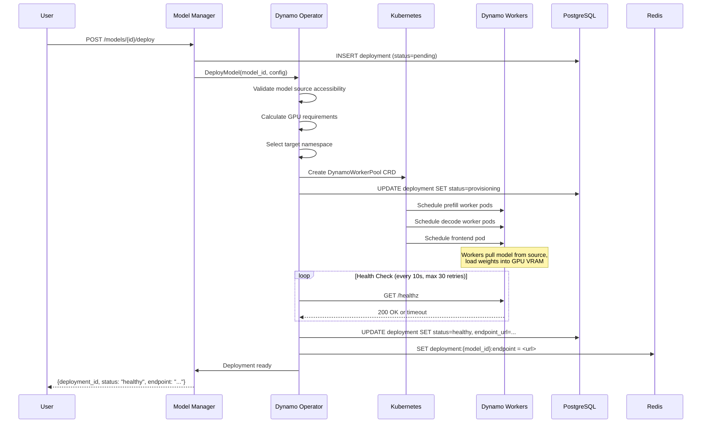
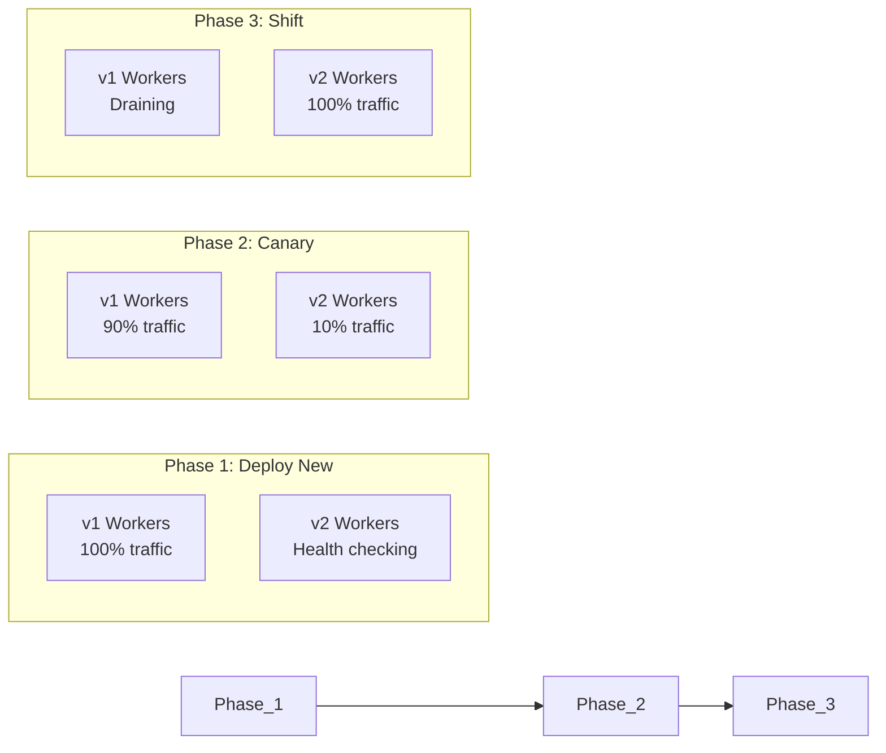

# NVIDIA Dynamo Integration Design

## 1. Overview

TaaS wraps NVIDIA Dynamo to provide multi-tenant inference serving with SLA guarantees. Dynamo handles the low-level GPU orchestration (disaggregated prefill/decode, KV cache management, smart routing), while TaaS adds the multi-tenancy layer on top: tenant isolation, API key scoping, usage tracking, and SLA enforcement.



## 2. Deployment Mapping

### 2.1 TaaS Deployment → Dynamo Worker Pool

Each TaaS model deployment maps to a Dynamo worker pool consisting of:

| TaaS Concept | Dynamo Concept |
|-------------|---------------|
| Model deployment | Worker pool (prefill + decode workers) |
| Model version | Container image tag |
| GPU allocation | Worker resource requests |
| SLA tier | Planner priority + latency targets |
| Autoscale config | HPA + custom metrics |

### 2.2 Deployment Configuration Mapping

When a user creates a deployment via `POST /models/{id}/deploy`, TaaS translates it to a Dynamo configuration:

```yaml
# TaaS deployment request
{
  "model_id": "model_01H8...",
  "gpu_count": 4,
  "gpu_type": "A100",
  "sla_tier": "standard",
  "max_batch_size": 64,
  "max_sequence_length": 4096
}

# Translates to Dynamo worker config
apiVersion: dynamo.nvidia.com/v1
kind: DynamoWorkerPool
metadata:
  name: model-01h8-pool
  namespace: taas-models-shared
  labels:
    taas.io/org-id: org_01H8...
    taas.io/model-id: model_01H8...
    taas.io/sla-tier: standard
spec:
  model:
    source: s3://taas-models/org_01H8/llama-70b/v1
    framework: vllm
    tensorParallel: 4
  prefillWorkers:
    replicas: 2
    resources:
      limits:
        nvidia.com/gpu: 2
    env:
      - name: MAX_BATCH_SIZE
        value: "64"
      - name: MAX_SEQ_LEN
        value: "4096"
  decodeWorkers:
    replicas: 2
    resources:
      limits:
        nvidia.com/gpu: 2
    env:
      - name: MAX_BATCH_SIZE
        value: "64"
  frontend:
    replicas: 1
    port: 8080
  planner:
    strategy: kv_aware  # Uses KV-cache locality for routing
    latencyTarget:
      p95Ms: 2000      # From SLA tier
```

### 2.3 Worker Sizing by SLA Tier

| SLA Tier | Prefill Workers | Decode Workers | GPU Type | Tensor Parallel | Namespace |
|----------|----------------|----------------|----------|-----------------|-----------|
| Free | 1 (shared) | 1 (shared) | A100 40GB | 1 | taas-models-shared |
| Standard | 2 | 2 | A100 80GB | 2-4 | taas-models-shared |
| Enterprise | Custom | Custom | H100 | 4-8 | taas-tenant-{id} |

## 3. Multi-Tenant Request Routing

### 3.1 Tenant-Aware Routing Flow



### 3.2 Tenant Isolation in Shared Pools

For Free and Standard tiers sharing worker pools, TaaS enforces isolation via:

1. **Priority-based scheduling**: Dynamo Planner assigns request priority based on `X-SLA-Tier` header
2. **Fair-share queuing**: Within the same priority level, requests are round-robin across tenants
3. **Preemption**: Enterprise requests can preempt Free-tier requests (with retry)
4. **Resource accounting**: Per-tenant GPU-second tracking for capacity planning
5. **Memory isolation**: Each request's KV cache is tagged with tenant ID; no cross-tenant cache sharing

### 3.3 Dedicated Pools (Enterprise)

Enterprise tenants get physically isolated worker pools:



The Gateway routes to the correct Dynamo Frontend based on the deployment's `endpoint_url`, which points to either the shared or dedicated Frontend.

## 4. SLA Enforcement via Dynamo Planner

### 4.1 Latency Targets

The Dynamo Planner supports per-request latency targets, which TaaS configures based on SLA tier:

```python
# Planner configuration per worker pool
planner_config = {
    "routing_strategy": "kv_aware_priority",
    "priority_levels": {
        "P0": {  # Enterprise
            "latency_target_p99_ms": 500,
            "preemption_allowed": True,
            "max_queue_depth": 100,
        },
        "P1": {  # Standard
            "latency_target_p95_ms": 2000,
            "preemption_allowed": False,
            "max_queue_depth": 500,
        },
        "P2": {  # Free
            "latency_target_p95_ms": None,  # Best-effort
            "preemption_allowed": False,
            "max_queue_depth": 50,
        },
    },
    "queue_overflow_action": "reject_lowest_priority",
}
```

### 4.2 SLA Monitoring Loop

```mermaid
graph TD
    PROM[Prometheus] -->|Scrape every 15s| METRICS[Dynamo Worker Metrics]
    SLA[SLA Monitor] -->|Query every 30s| PROM

    SLA -->|Check| EVAL{P95 latency ><br/>SLA target?}
    EVAL -->|Violation| RECORD[Record in PostgreSQL]
    EVAL -->|OK| NOOP[Continue monitoring]

    RECORD --> ALERT[Publish NATS event<br/>events.sla.violation.{org_id}]
    ALERT --> CREDIT[Calculate billing credit]
    ALERT --> SCALE[Trigger autoscale-up]
```

### 4.3 SLA Violation Detection

The SLA Monitor runs the following check every 30 seconds per deployment:

```python
async def check_sla(deployment_id: str, policy: SLAPolicy):
    # Query Prometheus for the deployment's latency histogram
    p95 = await prometheus.query(
        f'histogram_quantile(0.95, '
        f'rate(dynamo_inference_duration_seconds_bucket'
        f'{{deployment_id="{deployment_id}"}}[5m]))'
    )
    p99 = await prometheus.query(
        f'histogram_quantile(0.99, '
        f'rate(dynamo_inference_duration_seconds_bucket'
        f'{{deployment_id="{deployment_id}"}}[5m]))'
    )

    violations = []
    if p95 * 1000 > policy.p95_latency_ms:
        violations.append(SLAViolation(
            type="latency_p95",
            observed=p95 * 1000,
            threshold=policy.p95_latency_ms,
        ))
    if p99 * 1000 > policy.p99_latency_ms:
        violations.append(SLAViolation(
            type="latency_p99",
            observed=p99 * 1000,
            threshold=policy.p99_latency_ms,
        ))

    for v in violations:
        await record_violation(deployment_id, policy, v)
        await nats.publish(f"events.sla.violation.{policy.org_id}", v)
```

## 5. KV-Aware Routing with Tenant Isolation

### 5.1 How Dynamo's KV Cache Works

Dynamo disaggregates prefill and decode phases, storing the KV cache in distributed memory (NIXL transport):

1. **Prefill Worker** computes attention KV pairs for the input prompt → stores in KV cache
2. **Planner** routes decode to a worker that has locality to the cached KV data
3. **Decode Worker** reads KV cache, generates tokens one at a time

### 5.2 Tenant Isolation in KV Cache

TaaS ensures tenant isolation at the KV cache level:

```
KV Cache Key Format:
  {deployment_id}:{request_id}:{layer}:{head}

Since deployment_id includes tenant context:
  - Shared models: deployment is per-model, requests tagged with tenant
  - Dedicated models: deployment is per-tenant, physical isolation
```

For shared deployments, Dynamo's Planner ensures:
- A tenant's KV data is only read by decode workers processing that tenant's request
- KV cache eviction is fair across tenants (LRU per tenant, not global LRU)
- Memory pressure from one tenant cannot starve another

### 5.3 Prefix Caching for Shared Models

When multiple tenants use the same model with similar system prompts, Dynamo's prefix caching can share the system prompt's KV cache:

```
Shared prefix cache (read-only, system prompt):
  {model_id}:prefix:{hash(system_prompt)}

Tenant-specific suffix cache:
  {deployment_id}:{request_id}:{layer}:{head}
```

This optimization reduces GPU memory for system prompts shared across tenants while maintaining isolation for user-specific data.

## 6. Autoscaling Strategy

### 6.1 Per-Model Scaling

Each model deployment has its own autoscaling policy:

```yaml
apiVersion: autoscaling/v2
kind: HorizontalPodAutoscaler
metadata:
  name: model-01h8-prefill-hpa
spec:
  scaleTargetRef:
    apiVersion: apps/v1
    kind: Deployment
    name: model-01h8-prefill
  minReplicas: 1
  maxReplicas: 8
  metrics:
    - type: Pods
      pods:
        metric:
          name: dynamo_queue_depth
        target:
          type: AverageValue
          averageValue: "10"      # Scale up if avg queue > 10
    - type: Pods
      pods:
        metric:
          name: dynamo_inference_p95_latency_ms
        target:
          type: AverageValue
          averageValue: "1500"    # Scale up if P95 > 1.5s
  behavior:
    scaleUp:
      stabilizationWindowSeconds: 60
      policies:
        - type: Pods
          value: 2
          periodSeconds: 120
    scaleDown:
      stabilizationWindowSeconds: 300
      policies:
        - type: Pods
          value: 1
          periodSeconds: 300
```

### 6.2 Per-Tenant Scaling (Enterprise)

Enterprise tenants can configure custom scaling policies:

```json
{
  "autoscale": {
    "enabled": true,
    "min_prefill_workers": 2,
    "max_prefill_workers": 16,
    "min_decode_workers": 2,
    "max_decode_workers": 16,
    "scale_up_trigger": {
      "metric": "p95_latency_ms",
      "threshold": 400,
      "window": "2m"
    },
    "scale_down_trigger": {
      "metric": "queue_depth",
      "threshold": 0,
      "window": "10m"
    },
    "schedule": [
      {"cron": "0 8 * * 1-5", "min_workers": 8},
      {"cron": "0 20 * * 1-5", "min_workers": 2}
    ]
  }
}
```

### 6.3 Scaling Decision Flow



## 7. Multi-Model GPU Sharing

### 7.1 Shared Worker Pool Architecture

For cost efficiency, multiple models can share the same GPU workers:



### 7.2 Model Packing Strategy

The Dynamo Operator uses a bin-packing algorithm to place models on GPUs:

1. **Calculate VRAM requirements**: model weights + max KV cache per concurrent request
2. **Sort models by tier priority**: Enterprise > Standard > Free
3. **Bin-pack onto available GPUs**: First-fit decreasing by VRAM
4. **Reserve headroom**: 10% VRAM reserved for burst KV cache

```python
def pack_models(models: list[ModelDeployment], gpus: list[GPU]) -> dict:
    """Assign models to GPUs using first-fit decreasing."""
    models_sorted = sorted(models, key=lambda m: m.vram_required, reverse=True)
    assignments = {gpu.id: [] for gpu in gpus}

    for model in models_sorted:
        for gpu in gpus:
            used = sum(m.vram_required for m in assignments[gpu.id])
            available = gpu.vram_total * 0.9  # 10% headroom
            if used + model.vram_required <= available:
                assignments[gpu.id].append(model)
                break
        else:
            raise InsufficientGPUCapacity(model)

    return assignments
```

### 7.3 Hot-Swapping Models

For infrequently used models on shared GPUs, TaaS supports cold-start with warm-up:

1. **Active**: Model weights loaded in VRAM, serving requests
2. **Warm**: Model weights in host memory (CPU RAM), 2-5s load time
3. **Cold**: Model weights on disk/S3, 30-60s load time

The Dynamo Operator manages model lifecycle transitions:

```
                      idle > 5min                idle > 30min
  Active ──────────────────────► Warm ──────────────────────► Cold
    ▲                              ▲                            │
    │     request arrives          │     request arrives        │
    └──────────────────────────────┘◄───────────────────────────┘
           2-5s warm-up                    30-60s cold start
```

## 8. Model Lifecycle: Deploy to Serve

### 8.1 Full Deployment Sequence



### 8.2 Deployment Steps in Detail



### 8.3 Health Checks

The Dynamo Operator performs three levels of health checks:

1. **Liveness**: Worker pod is running (`/healthz` returns 200)
2. **Readiness**: Model weights loaded, worker accepting requests (`/readyz` returns 200)
3. **Inference validation**: Send a minimal test prompt and verify response

```python
async def health_check(deployment: Deployment) -> HealthStatus:
    # Level 1: Pod liveness
    for worker in deployment.workers:
        resp = await http.get(f"{worker.url}/healthz", timeout=5)
        if resp.status != 200:
            return HealthStatus.UNHEALTHY

    # Level 2: Readiness
    resp = await http.get(f"{deployment.frontend_url}/readyz", timeout=10)
    if resp.status != 200:
        return HealthStatus.NOT_READY

    # Level 3: Inference smoke test
    resp = await http.post(
        f"{deployment.frontend_url}/v1/completions",
        json={"prompt": "test", "max_tokens": 1},
        timeout=30,
    )
    if resp.status != 200:
        return HealthStatus.DEGRADED

    return HealthStatus.HEALTHY
```

### 8.4 Rolling Updates

When updating a model version:

1. Deploy new workers alongside existing ones (blue-green)
2. Health-check new workers
3. Shift traffic via Planner (gradual canary: 10% → 50% → 100%)
4. Drain old workers (wait for in-flight requests to complete)
5. Terminate old workers



## 9. Error Handling & Resilience

### 9.1 Dynamo Worker Failures

| Failure | Detection | Recovery |
|---------|-----------|----------|
| Worker pod crash | K8s liveness probe (10s) | Auto-restart, re-register with Planner |
| GPU OOM | Worker error log + exit code | Reduce batch size, reschedule |
| Model corruption | Inference smoke test fails | Re-pull model from source |
| Frontend unreachable | Gateway connection timeout | Circuit breaker, failover to backup |
| Planner overloaded | Queue depth > max | Reject lowest priority, scale up |

### 9.2 Circuit Breaker (Gateway → Dynamo)

The Gateway maintains a circuit breaker per deployment endpoint:

```
States:
  CLOSED   → Normal operation, forward requests
  OPEN     → 5 consecutive 5xx or timeouts → reject with 503 for 30s
  HALF-OPEN → After 30s, allow 1 probe request
             → Success: CLOSED
             → Failure: OPEN (reset timer)
```

### 9.3 Request Retry Policy

```yaml
retry_policy:
  max_retries: 2
  retryable_status_codes: [502, 503, 504]
  retry_on_timeout: true
  backoff:
    initial_ms: 100
    max_ms: 2000
    multiplier: 2
  # Never retry streaming requests (SSE) — client handles reconnection
  exclude_streaming: true
```
